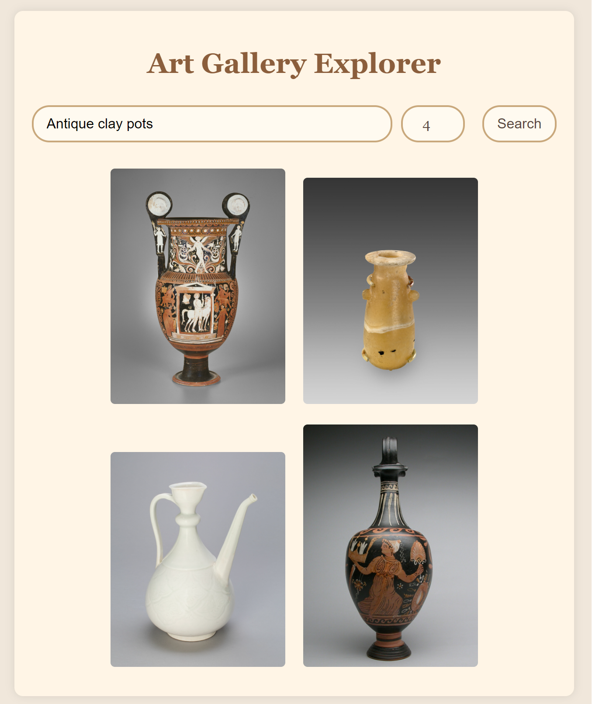
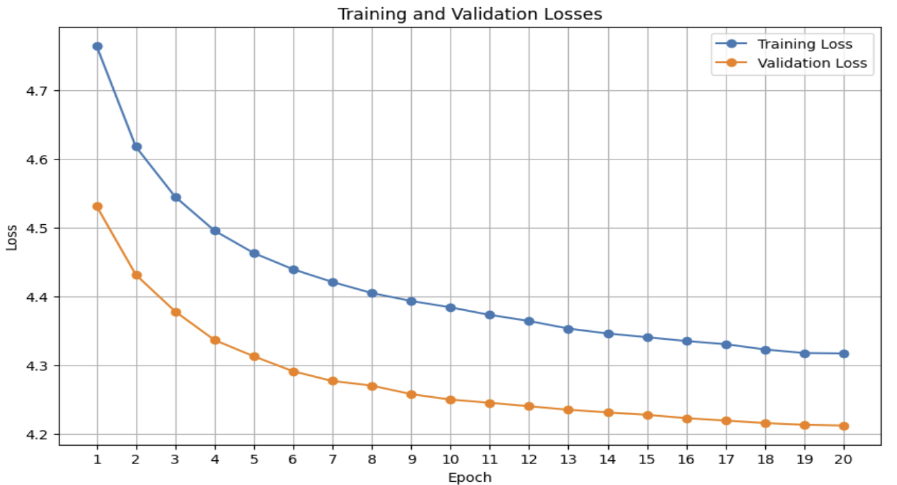
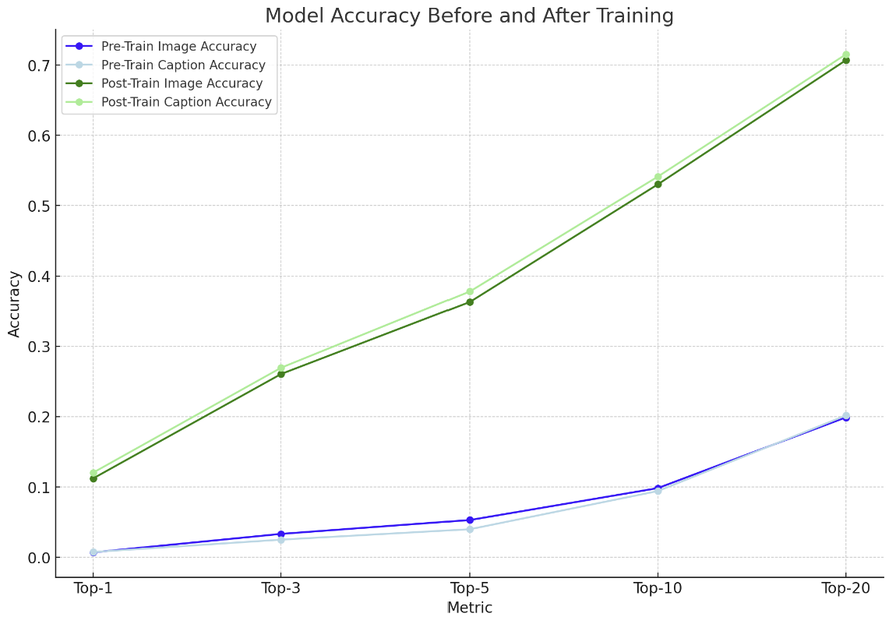

[](https://github.com/NickStrauch13/image-to-text-embedding/actions/workflows/python-ci.yml)

# Training Multimodel Image and Text Embeddings for Art Museum Search

Transfer learning both with [CLIP](https://github.com/openai/CLIP) and google ViT to learn a latent space for both text and images for use retrieving images from a database based on natrual language prompts.

<p align="center">
    
</p>

## Data

Data was sourced from [Art Institute of Chicago](https://www.artic.edu/open-access/public-api) open api and stored in a local Sqlite3 database. The data consisted of images along with descriptions found at the museum.

## Training

Using Kaggle notebooks, found in `notebooks/`, we finetuned CLIP using the labeled art data. The custom CLIP model configuration can be found in `src/clip_utils.py`. The trained weights are [here](https://drive.google.com/file/d/1rGNPti0CtLzVJ4-zq7YGHHu1tSdUEWTD/view?usp=sharing).

## Pipeline

Once we had a trained model, we can use it for embedding both images and text. In order to build the art retrieval app, we first embedded all of the art images and saved those in to a Pinecone vector database. Now that the images are in the latent space, on inference we embed the text prompt in to the same space and pull the closest few images from pinecone based on cosine similarity.

## Project Structure

```
├── .devcontainer
├── .github
├── app
│   ├── static
│   ├── templates
├── data
├── models
├── notebooks
├── src
├── .gitignore
├── Makefile
├── README.md
├── requirements.txt
├── setup.sh
```

## To Use

The run the application locally, follow these steps:
1. Clone the repository to your local machine.
2. Create a virtual python environment using `python -m venv venv`.
3. Activate the virtual environment using `source venv/bin/activate` for mac/linux or `venv\Scripts\activate` for windows.
4. Install the project requirements using `pip install -r requirements.txt`.
5. Create a `.env` file in the root directory to access the Pinecone database. The only line in the file should be `PINECONE_API_KEY=???`. Please reach out to mbk28@duke.edu to request a Pinecone API key.
6. Download the pretrained weights for our finetuned CLIP model from [here](https://drive.google.com/file/d/1rGNPti0CtLzVJ4-zq7YGHHu1tSdUEWTD/view?usp=sharing) and place them in a `models/` directory in the project root.
7. Run the application from the root directory using `python ./app/server.py`.

## Results

We found improvement with our finetuned model over the base CLIP model in our art specific task. On the test set, our model had a top-5 retrieval accuracy of about 0.36 while the base CLIP model had a top-5 accuracy of about 0.06.

<div style="display: flex; justify-content: space-around; align-items: center;">
    
    
</div>
